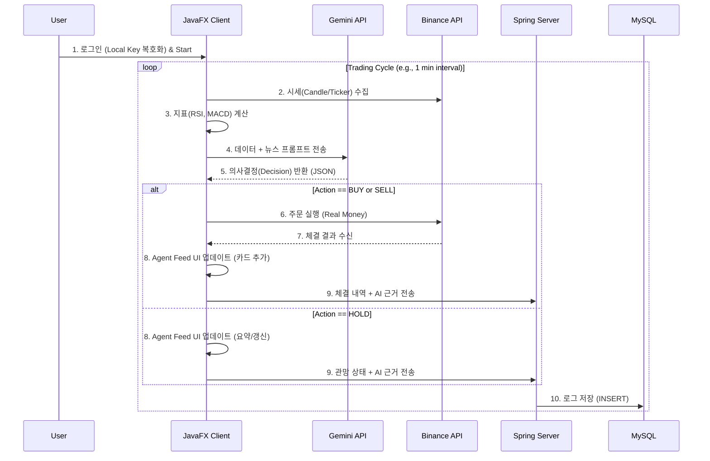

## 1. 프로젝트 개요 (Project Overview)

- **프로젝트명:** BitBot (Bitcoin Investment Trading Bot)
- **버전:** v1.0.0
- **개발 언어:** Java 17 LTS (Language Level 17)
- **프로젝트 성격:** `자바프로그래밍심화` 전공 텀프로젝트
- **핵심 목표:**
    - **Pure Java Implementation:** JavaFX와 JDBC 등 자바 표준 기술을 심도 있게 활용.
    - **AI-Driven Trading:** LLM(Gemini)을 활용하여 단순 지표 매매를 넘어선, 뉴스/시장 심리를 반영한 지능형 에이전트 구현.
    - **XAI (Explainable AI):** AI가 왜 매수/매도/관망을 선택했는지에 대한 근거를 사용자에게 투명하게 시각화(Agent Feed).
    - **Secure Architecture:** 민감한 API Key는 서버에 전송하지 않고 로컬에 암호화하여 저장하는 분산형 보안 구조 채택.

## 2. 시스템 아키텍처 (System Architecture)

교수님의 "Spring 지양(클라이언트)"과 "MySQL 활용(서버)" 요구사항을 모두 충족하기 위해 **Hybrid Client-Server Architecture**를 설계함.

### 2.1. 구성 요소 (Components)

1. **BitBot Client (Desktop App):**
    - **Tech:** JavaFX, `java.net.http`, Jackson, AES-256.
    - **Role:** UI 렌더링, 시세 데이터 수집, 기술적 지표 연산, LLM 통신, **실제 주문 실행(Binance)**, 로컬 키 관리.
2. **Logging Server (Middleware):**
    - **Tech:** Spring Boot 3.x.
    - **Role:** 사용자 인증, 투자 성향 프로필 관리, **매매 로그 및 분석 리포트 중앙 저장**.
    - **DB Access:** **Raw JDBC** (`JdbcTemplate`) 사용 (JPA 미사용).
3. **Database:**
    - **Tech:** MySQL 8.0.
    - **Role:** 영속적 데이터 저장 (User, Profile, Logs).

### 2.2. 데이터 흐름 (Data Flow)



## 3. 핵심 기능 요구사항 (Functional Requirements)

### 3.1. 사용자 온보딩 및 투자 성향 분석 (Risk Profiling)

- **기능:** 최초 실행 시 15문항의 설문조사 진행.
- **알고리즘:** 점수 합산(12~48점)에 따라 4가지 전략 중 하나 자동 매핑.
    1. **안정 추구형 (Conservative):** RSI < 30 분할 매수, 레버리지 금지, 손절 -15%.
    2. **위험 중립형 (Moderate):** 추세 추종(MACD), 손절 -7%.
    3. **적극 투자형 (Aggressive):** 볼린저 밴드 이탈 매매, 레버리지 허용(3x), 손절 -5%.
    4. **전문 투기형 (Speculative):** 변동성 돌파, 고배율 허용, 손절 -3%.

### 3.2. 자동 매매 엔진 (Auto Trading Engine)

- **모드:** 단일 **Auto Mode** (Start/Stop 버튼). 복잡한 승인 절차 제거.
- **3-Way Decision Logic:**
    - **BUY:** 상승 시그널 + 자금 여력 충분 + 리스크 허용 범위 내.
    - **SELL:** 목표가 도달 OR 손절가 도달 OR 하락 시그널 감지.
    - **HOLD:** 방향성 불확실(횡보) OR 급격한 변동성(위험). **(수수료 절감 및 자산 방어 목적)**

### 3.3. 설명 가능한 AI (Agent Feed)

- **UI 컨셉:** 채팅창이 아닌 **"타임라인 피드(Timeline Feed)"**.
- **동작:** AI의 판단이 발생할 때마다 카드가 쌓임.
- **UX:**
    - 기본: 요약 정보 (Action, 시간, 한 줄 요약).
    - 클릭 시: 아코디언 형태로 펼쳐지며 상세 분석 근거(Reasoning) 및 당시 차트 스냅샷 표시.

## 4. UI/UX 상세 명세 (User Interface)

**전체 레이아웃:** JavaFX `BorderPane` 기반의 3단 분할.

### 4.1. Left: Navigation Bar (Width: Fixed 60~80px)

- 아이콘 위주의 탭 메뉴 (Ikonli 라이브러리 활용).
- **Menus:**
    - 🏠 **Dashboard:** 메인 화면.
    - 💼 **Portfolio:** 자산 현황, 미체결 주문, 수익률 그래프.
    - 📖 **Journal:** 과거 매매 이력 조회 (DB 데이터 바인딩).
    - ⚙️ **Settings:** API 키 관리, 투자 성향 재설정, 로그 콘솔.

### 4.2. Center: Dashboard (Main Info Deck)

- `ScrollPane` 내부에 `VBox`로 구성하여 정보량이 많아지면 스크롤 가능.
- **Header:** BTC 실시간 가격, 등락률, 공포/탐욕 지수.
- **Main Chart:**
    - **Custom CandleStickChart:** `javafx.scene.chart.XYChart`를 상속받아 직접 구현.
    - 기능: Zoom/Pan, 매매 시점 마커(Arrow) 표시.
- **Order Book:** 매수/매도 호가 잔량 시각화.
- **Indicator Cards:** RSI, MACD, BB 현재 수치 요약.

### 4.3. Right: Agent Feed (Activity Log)

- **Component:** `ListView<TradeLog>` + Custom `ListCell`.
- **Header:** 에이전트 상태 (🟢 Monitoring / 🟡 Analyzing).
- **List Item Design:**
    - **Collapsed (기본):** `[ICON]` `[Action]` `[Brief Reason]` `[Time]`
        - 예: 🟢 **BUY** | RSI 과매도 진입 확인 | 14:05
    - **Expanded (상세):**
        - **Full Reasoning:** "현재 RSI 28로 과매도 상태이며, 비트코인 현물 ETF 관련 긍정적 뉴스로 인해 단기 반등이 예상됩니다."
        - **Snapshot:** `RSI: 28.5`, `Price: $98,000`
        - **Execution:** `Price: $98,050`, `Qty: 0.001 BTC`

## 5. 데이터베이스 스키마 (MySQL Schema)

### 5.1. `users`

| Column | Type | Description |
| --- | --- | --- |
| `user_id` | BIGINT (PK) | Auto Inc |
| `username` | VARCHAR(50) | ID |
| `password_hash` | CHAR(60) | BCrypt |
| `api_key_hash` | VARCHAR(255) | (Optional) 로컬 키 유효성 검증용 해시 |

### 5.2. `risk_profiles`

| Column | Type | Description |
| --- | --- | --- |
| `profile_id` | BIGINT (PK) | Auto Inc |
| `user_id` | BIGINT (FK) | Users FK |
| `invest_type` | ENUM | CONSERVATIVE, MODERATE, AGGRESSIVE, SPECULATIVE |
| `stop_loss_pct` | DECIMAL | 손절 비율 |

### 5.3. `trade_logs`

*HOLD를 포함한 모든 AI의 판단을 기록.*

```sql
CREATE TABLE trade_logs (
    log_id BIGINT AUTO_INCREMENT PRIMARY KEY,
    user_id BIGINT NOT NULL,
    symbol VARCHAR(20) DEFAULT 'BTCUSDT',

    -- AI Decision (HOLD 포함)
    action_type ENUM('BUY', 'SELL', 'HOLD') NOT NULL,
    confidence_score DECIMAL(5, 2), -- 0~100
    brief_reason VARCHAR(255), -- 리스트용 요약
    full_reason TEXT, -- 상세 분석 내용

    -- Execution Details (HOLD시 NULL)
    executed_price DECIMAL(20, 8) NULL,
    executed_qty DECIMAL(20, 8) NULL,
    realized_pnl DECIMAL(20, 8) NULL, -- 매도 시 수익금

    -- Context
    market_snapshot JSON, -- {"rsi": 32, "ma20": 98000}
    created_at TIMESTAMP DEFAULT CURRENT_TIMESTAMP,

    FOREIGN KEY (user_id) REFERENCES users(user_id)
);

```

## 6. 기술 구현 상세 (Technical Specifications)

### 6.1. Java 17 Features

- **Records:** DTO 객체 (`TradeDecision`, `MarketData`) 불변성 보장.
- **Enhanced Switch:** 매매 로직 분기 처리 (`case BUY -> ...`).
- **Text Blocks:** SQL 쿼리 및 LLM 프롬프트 가독성 확보.

### 6.2. Network & Async

- **HttpClient:** `java.net.http.HttpClient` 사용 (외부 라이브러리 최소화).
- **CompletableFuture:** 시세 수신 -> 분석 -> 주문 과정을 Non-blocking으로 처리하여 UI 프리징 방지.
- **Platform.runLater:** 백그라운드 스레드에서 UI 업데이트 시 필수 사용.

### 6.3. Security (Local Encryption)

- **알고리즘:** AES/GCM/NoPadding (256-bit).
- **키 관리:** 사용자 비밀번호 기반 PBKDF2로 Key Derivation.
- **저장소:** 로컬 파일 시스템(`config.dat`)에만 저장하며, 서버 DB에는 절대 저장하지 않음.

### 6.4. Server-Side (Spring Boot)

- **Persistence:** `JdbcTemplate` 사용 (JPA 배제). SQL 직접 작성 능력 강조.
- **API:** Client와 JSON 통신을 위한 REST Controller 구현.

## 7. 개발 로드맵 (Development Roadmap)

1. **Phase 1: GUI Foundation**
    - JavaFX 프로젝트 세팅.
    - Main Layout (BorderPane, SplitPane) 구성.
    - **Custom CandleStickChart 구현 (최우선 과제).**
2. **Phase 2: Data & Security**
    - Binance Public API 연동 (시세).
    - AES-256 암호화 모듈 및 로컬 파일 입출력 구현.
3. **Phase 3: AI Brain & Logic**
    - 기술적 지표(RSI, MACD) 계산 로직 구현.
    - Gemini API 연동 (Prompt Engineering).
    - **3-Way Action (Buy/Sell/Hold) 로직 완성.**
4. **Phase 4: Backend Integration**
    - MySQL 스키마 구축.
    - Spring Boot 서버 및 JDBC Repository 구현.
    - Client-Server 로그 전송 연동.
5. **Phase 5: Final Polish**
    - Binance Order API (실거래) 연동.
    - Agent Feed UI 디테일(Accordion) 작업.
    - 통합 테스트 및 예외 처리.